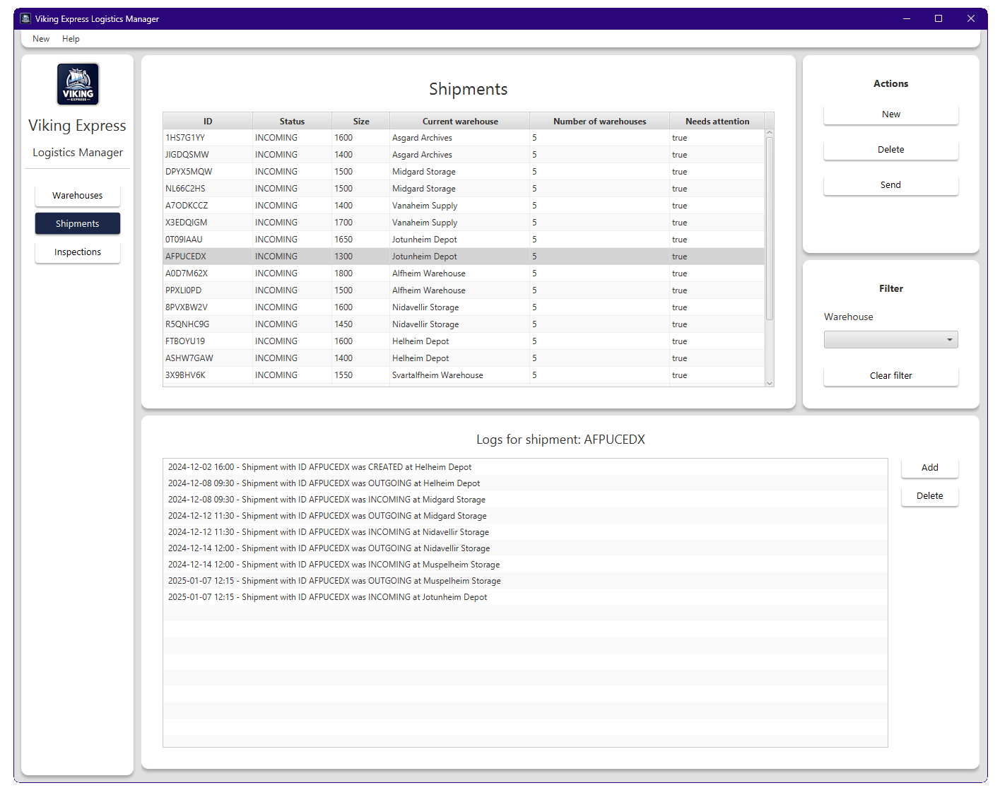

# Description
The developed system is a Java-based inventory management application for VikingExpress, adhering to the Model-View-Controller (MVC) architecture. It provides comprehensive functionalities to manage warehouses and shipments, including creating, reading, updating, and deleting records for warehouses, shipments, logs, and inspections. The application features an intuitive graphical user interface with error handling, ensuring user-friendly interaction.

Key features include tracking warehouse capacities, displaying shipment histories, calculating throughput, and detecting transportation loops. Capacity and inspection constraints are enforced, alongside automatic generation of unique shipment IDs. The system offers detailed regional and warehouse-level insights, supporting the organization’s operational goals effectively.

